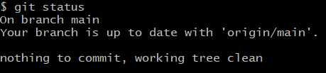

# Шпаргалка Git

## Инициализируем репозиторий

Чтобы Git начал отслеживать изменения в проекте, папку с файлами этого проекта нужно сделать **Git-репозиторием**

Для этого нужно выполнить команду `git init`.

```bash
$ git init
```

<strong>Помните, что не рекомендуется создавать репозиторий Git внутри другого Git-репозитория. Это может вызывать проблемы с отслеживанием изменений.</strong>

Если вы случайно сделали Git-репозиторием не ту папку, её можно «разгитить». Для этого нужно удалить скрытую подпапку `.git`.

```bash
$ cd <папка с репозиторием> # перешли в папку

$ rm -rf .git # удалили подпапку .git
```

## Проверить состояние репозитория

Команда `git status` показывает текущее состояние репозитория.

```bash
$ git status # в папке с репозиторием
```



Команда `git status` выведет:

- название текущей ветки: `On branch master` или `On branch main`;
- сообщение о том, что в репозитории ещё нет коммитов: `No commits yet`;
- сообщение, которое говорит: «чтобы что-нибудь закоммитить (то есть зафиксировать), нужно сначала это создать» — `nothing to commit (create/copy files and use "git add" to track)`.

## Подготовить файлы к сохранению

Мы хотим отслеживать состояние обоих, поэтому можем использовать команду `git add --all`. Ключ, или флаг, `--all` позволяет подготовить к сохранению все файлы в репозитории.

```bash
$ git add --all # подготовили к сохранению все файлы в репозитории
$ git status # проверили статус
```

Также можно добавить текущую папку целиком — в этом случае все файлы в ней тоже будут добавлены. Обратиться к текущей папке в Bash позволяет точка (`.`).

```bash
$ git add . # добавить всю текущую папку
$ git status
```

## Выполнить коммит — git commit

Сделать коммит можно командой `git commit` c ключом `-m`(от англ. message — «сообщение»), который присваивает коммиту сообщение.

## Просмотреть историю коммитов — git log

Чтобы увидеть все коммиты, введите команду git log (от англ. log — «журнал [записей]»).

Обратите внимание, что по умолчанию `git log` выводит коммиты в обратном хронологическом порядке — последние коммиты оказываются первыми сверху. В этом можно убедиться, если посмотреть на дату и время их создания.

## Привязать удалённый репозиторий к локальному — git remote add

Откройте консоль, перейдите в каталог локального репозитория и введите команду `git remote add` (от англ. remote — «удалённый» и add — «добавить»).

```bash
$ cd ~/dev/first-project
$ git remote add origin git@github.com:%ИМЯ_АККАУНТА%/first-project.git
```

Команде необходимо передать два параметра: имя удалённого репозитория и его URL. В качестве имени используйте слово `origin`. А URL вы скопировали со страницы удалённого репозитория.

### Убедиться, что репозитории связаны, — git remote -v

Отлично: вы связали локальный репозиторий с удалённым. Осталось убедиться, что всё работает, с помощью следующей команды.

```bash
$ git remote -v
origin    git@github.com:%ИМЯ_АККАУНТА%/%ИМЯ-ПРОЕКТА%.git (fetch)
origin    git@github.com:%ИМЯ_АККАУНТА%/%ИМЯ-ПРОЕКТА%.git (push)
```
